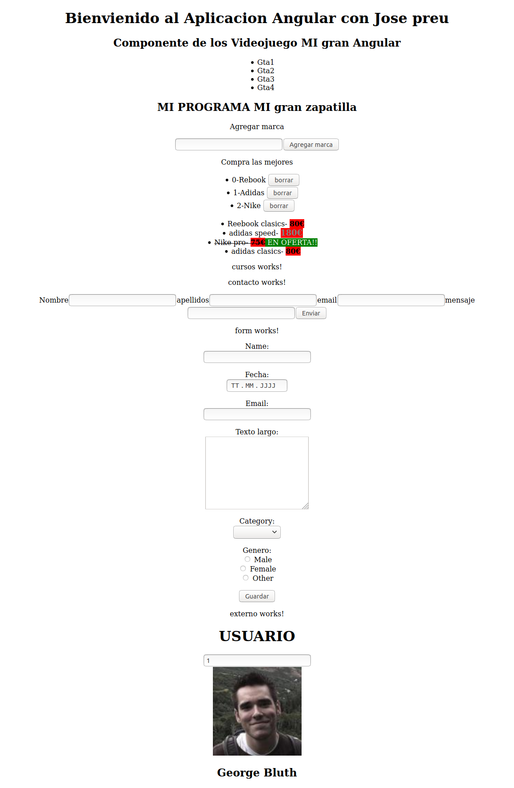

# Proyecto1

This project was generated with [Angular CLI](https://github.com/angular/angular-cli) version 8.3.23.

## Development server

Run `ng serve` for a dev server. Navigate to `http://localhost:4200/`. The app will automatically reload if you change any of the source files.

## Code scaffolding

Run `ng generate component component-name` to generate a new component. You can also use `ng generate directive|pipe|service|class|guard|interface|enum|module`.

## Build

Run `ng build` to build the project. The build artifacts will be stored in the `dist/` directory. Use the `--prod` flag for a production build.

## Running unit tests

Run `ng test` to execute the unit tests via [Karma](https://karma-runner.github.io).

## Running end-to-end tests

Run `ng e2e` to execute the end-to-end tests via [Protractor](http://www.protractortest.org/).

## Further help

To get more help on the Angular CLI use `ng help` or go check out the [Angular CLI README](https://github.com/angular/angular-cli/blob/master/README.md).
# angular8-curso_udemy


# Install Angular 9 on Linux (Ubuntu/Debian/Mint/CentOS/RHEL/SuSE Linux) 

## Install Node.js and NPM on Ubuntu with PPA
### Add Node.js from NodeSource
This is the simplest method to install a specific version of Node.js. You can quickly follow the below steps to install Node.js 13.x, 12.x, 10.x version. To install Node.js and npm from the NodeSource repository, follow the below steps:

* First, add the Node.js PPA to your system to install Nodejs on Ubuntu.
```
curl -sL https://deb.nodesource.com/setup_13.x | sudo -E bash -
```
* install Node.js on Ubuntu
```
sudo apt-get install -y nodejs
```
* Check Installed Node.js and NPM version
```
node --version
```
###  Install Angular 9 on Linux (Ubuntu/Debian/Mint/CentOS/RHEL/SuSE Linux) 

Install

    if you don’t have a current Angular installation in your environment, use below command to install exactly Angular 9 using npm.

$ npm install --global @angular/cli@9.0.0-rc.14

    The above command will install angular 9.0.0-rc.14 which is the latest version at the time of writing. But to make sure you have the latest Angular release version in the future, run the below command too.

$ ng update @angular/core@9 @angular/cli@9

    However, if your intention is to install the latest stable version or latest next release version, you can specify those too.

$ npm install --global @angular/cli
$ npm install --global @angular/cli@stable
$ npm install --global @angular/cli@next


